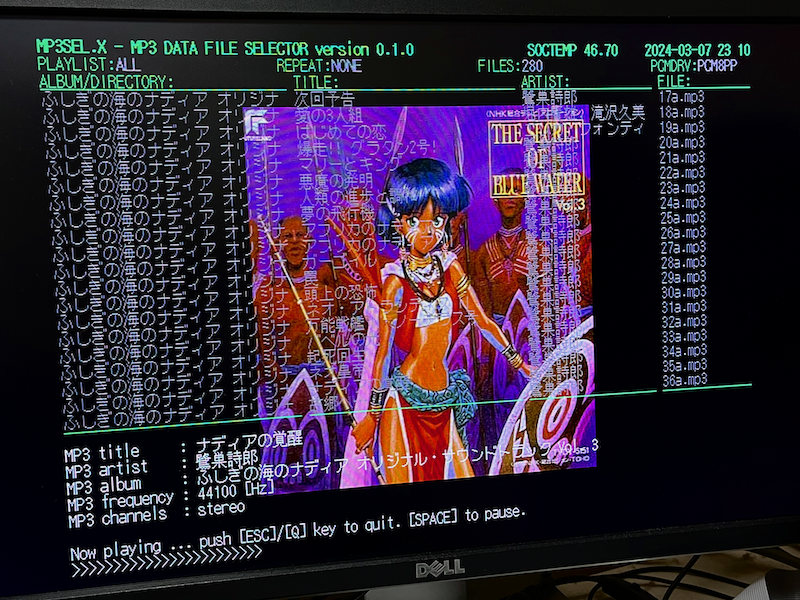
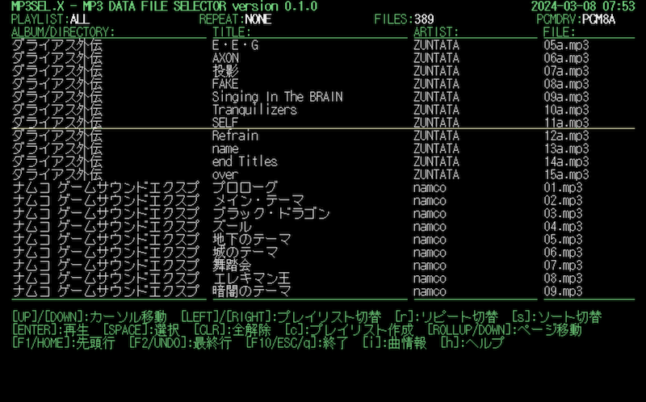

# MP3SEL.X

MP3 Data File Selector for Human68k/X680x0

---

## About This

MP3音楽データファイルのセレクタです。拙作MP3プレーヤ[HMP3P.X](https://github.com/tantanGH/hmp3p)のフロントエンドとして使います。

 - ID3v2タグ対応
 - プレイリスト対応
 - リピート再生対応
 - シャッフル再生対応

Human68k用の汎用ファイラではMP3のタグを扱えるものがまだ存在しないため、ディレクトリ名やファイル名で曲データを管理・検索する必要があります。MP3SEL.XはMP3のID3タグに対応しているため、アルバム名や曲名を見ながら簡単に曲を選択することができます。また、プレイリストを複数作成したり、リピート再生やシャッフル再生を行うこともできます。

---

## 動作環境

[HMP3P.X](https://github.com/tantanGH/hmp3p) 0.2.6以降が動作していることが前提条件となります。メインメモリはお使いの環境にもよりますが、最低でも4MB程度は必要かと思います。

---

## インストール

MP3SLxxx.ZIP をダウンロードして、MP3SEL.X をパスの通ったディレクトリにコピーします。

以下の2つの環境変数を設定しておきます。

- MP3SEL_DATA_PATH ... MP3データファイルを格納してあるディレクトリ名をセミコロン(;)で区切って連結したもの。ディレクトリは再帰的にスキャンされますので、一番上の階層だけで大丈夫です。

- MP3SEL_LIST_PATH ... プレイリストファイル(*.MPL)を格納してあるディレクトリ名。1つだけ指定可能です。

例：

    SET MP3SEL_DATA_PATH=I:\MP3;J:\MP3
    SET MP3SEL_LIST_PATH=D:\MP3_LIST

---

## 利用方法

必要な環境変数を設定した上で、

    mp3sel

で起動します。条件に不足があった場合は起動エラーとなりますのでメッセージを確認してください。

コマンドラインオプションもいくつかありますが、詳細は `-h` で表示されるヘルプを参照してください。

起動直後の画面は上記のようになります。

- 1行目 ... アプリケーションのバージョン、PhantomXのSoC温度、日付と時刻
- 2行目 ... 現在選択されているプレイリスト名、現在のリピートモード、ファイル数、PCMドライバの種類
- 4行目以降 ... MP3データのリスト
- 下段部 ... 操作説明

起動直後はプレイリスト"ALL"となっています。これは`MP3SEL_DATA_PATH`で指定したディレクトリ全体からスキャンしたすべてのMP3ファイルがリストされます。
プレイリストはカーソルの左右で切り替えが可能です。

カーソルバーはカーソルキーの上下で動かせます。その他ページ送りやリスト先頭・末尾へのジャンプなどもありますのでヘルプメッセージを参照してください。
なお、ヘルプに書かれていませんが、emacsキーバインドおよびviキーバインドの一部も対応しています。

リターンキーを押すと選択されているMP3データを再生します。

---

`r`キーを押すとリピートモードを切り替えることができます。(詳細後述)

`s`キーを押すとソート順を切り替えることができます。

`h`キーを押すと起動直後に表示されるものと同じ操作方法のヘルプを下段部に表示します。

`ESC`キー、`q`キー、F10キーで終了します。

---

## リピート再生

`r`キーを押すたびに、リピートモードを切り替えることができます。
NONE -> ALBUM -> SHUFFLE -> SINGLE -> SINGLE2 -> SINGLE3 -> NONE -> ... と押すたびに切り替わります。

- NONE ... リピートしません。1回だけ再生します。

- ALBUM ... 再生終了後、リスト上の次のMP3データを順番に1回ずつ再生します。リストの最後までいくと先頭に戻って繰り返します。

- SHUFFLE ... 再生終了後、リスト上のMP3データをランダムに1回ずつ再生します。

- SINGLE ... 同一ファイルを無限回リピートします。

- SINGLE2 ... 同一ファイルを2回再生し次に進みます。

- SINGLE3 ... 同一ファイルを3回再生し次に進みます。

いずれのモードであっても、`ESC`で再生キャンセルするか、`SHIFT`でロードキャンセルするとリピート動作を停止します。

---

## History

* 0.1.0 (2023/03/08) ... 初版
